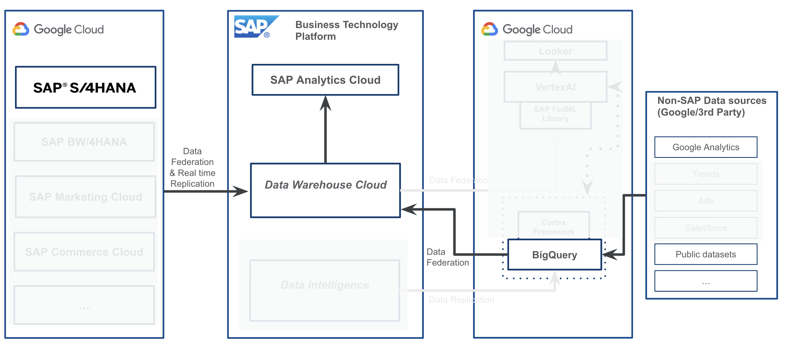

#  How to Enable Category Management with Google BigQuery and SAP Data Warehouse Cloud / SAP Analytics Cloud

## Description

This repository contains the material for the Hands-on session called **Enable Category Management with Google BigQuery and SAP Data Warehouse Cloud / SAP Analytics Cloud**.  

## Overview

This usecase provides the ability to analyze category performance for digital/online sales by combining external source systems like Google Analytics and sales, discounts, and stock data from SAP systems. With a data federation architecture, it is possible to leave data in its source system and access it in one location without replication. With this architecture, customers can combine their Big Query and SAP data to derive new insights.

## Challenges and Business Drivers
Multiple scattered source systems (external and SAP) makes analysis of category performance difficult. The inability and the high cost of bringing data sources together make root cause analysis of online sales a burdensome process.

## Outcome

Unified data federation architecture allows customers to combine external data sources (Google Analytics and Google BigQuery) with SAP data sources for live category analysis without business data replication and with state-of-the-art performance in one central location.

## Solution Overview
After configuring the Google BigQuery and SAP Data Warehouse Cloud connection, customers can create data models combining external and SAP data to unlock new insights. Through SAP Analytics Cloud (SAC) customers can do live on the fly analysis across multiple data sources in real-time.

## User Credentials

**IMPORTANT**: A student number has been given to you. You will repeatedly see the placeholder **\<STUDENT>** throughout the entire session. Please replace this placeholder with your own student number whenever it's needed.

| System                            | User                            | Password   |
| --------------------------------- | ------------------------------- | ---------- |
| [SAP Data Warehouse Cloud](https://ccebd5f3-3595-488d-846d-eda360636613.us10.hcs.cloud.sap/dwaas-ui/index.html#/home) | ghack\<STUDENT>@saptfe-demo.com  | Welcome2!  |
| [SAP Analytics Cloud](https://sunrise.us10.hcs.cloud.sap/sap/fpa/ui/app.html#/home) | ghack\<STUDENT>@saptfe-demo.com  | Welcome2!  |

## Exercises

- [Introduction - Understand SAP Data Warehouse Cloud and Google BigQuery setup and given data models](exercises/ex1/)
- [Exercise 2 - Build and expose your data views on SAP Data Warehouse Cloud](exercises/ex2/)
- [Exercise 3 - Create Category Management Dashboard on SAP Analytics Cloud](exercises/ex3/)

## How to obtain support

Support for the content in this repository is available during the actual time of the online session for which this content has been designed. Otherwise, you may request support via the [Issues](../../issues) tab.

## License
Copyright (c) 2022 SAP SE or an SAP affiliate company. All rights reserved. This project is licensed under the Apache Software License, version 2.0 except as noted otherwise in the [LICENSE](LICENSES/Apache-2.0.txt) file.
