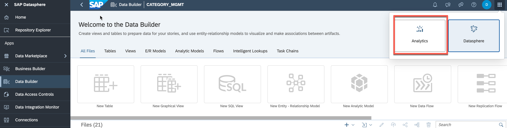

# Drive Profitable Growth with Google BigQuery, SAP Datasphere, and SAP Analytics Cloud

## Overview

This use case provides the ability to analyze product performance for digital/online sales by combining external source systems like Google Analytics and sales, discounts, and stock data from SAP systems. With a data federation architecture, it is possible to leave data in its source system and access it in one location without replication. With this architecture, customers can combine their BigQuery and SAP data to derive new insights.

## Challenges and Business Drivers
Data on multiple scattered source systems (external and SAP) make analysis of product performance difficult. The inability and the high cost of bringing data sources together make root cause analysis of online sales a burdensome process.

## Outcome

Unified data federation architecture allows customers to combine external data sources (Google Analytics and Google BigQuery) with SAP data sources for live analysis without business data replication and with state-of-the-art performance in one central location.

## Solution Overview
After configuring the Google BigQuery and SAP Datasphere connection, customers can create data models combining external and SAP data to unlock new insights. Through SAP Analytics Cloud (SAC) customers can do on-the-fly analysis across multiple data sources in real-time.

## Story

In today's competitive online marketplace, understanding customer behavior and optimizing sales strategy is crucial for success. Managers need to analyze product performance and uncover hidden insights to drive revenue growth. By combining data from external sources like Google Analytics with sales, discounts, and stock data from SAP systems, we can create a holistic and real-time view of product performance. 

**Manager:** Let's imagine that we want to analyze our digital sales performance for a specific product and understand how it is impacted by factors such as discounts, stock availability, and competition. We need to combine data from Google Analytics and our SAP systems to get a holistic view of the situation.

SAP Datasphere uses a data federation approach that allows us to access data from multiple sources in one central location, without the need for replication. This means that we can combine our Google BigQuery and SAP data sources for live performance analysis with state-of-the-art performance.

1. To begin, we need to configure the connection between Google BigQuery and SAP Datasphere. This will enable us to create data models that combine external and SAP data to unlock new insights.

   * Showing the process of establishing a connection between SAP DataSphere and Google BigQuery
  
        

   * Navigate to **Data Builder** and select a modeled data view, such as **"Product_Sales_Country_Discount"**. Demonstrate the impact analysis feature, highlighting in a next step integration with the BigQuery data source
  
        

    * Demonstrate, how "product_transaction" data is federated from Google BigQuery into our system
  
        

2. Once the connection is established and data is harmonized, we can use SAP analytics Cloud to perform live, on-the-fly analysis across multiple data sources in real-time. This will allow us to understand the root cause of the customer journey and optimize our online sales strategy accordingly.

   * Opening the SAP Analytics Cloud (SAC) to display the dashboard, which is constructed based on the previously demonstrated data model
  
        

   * Launch the story "Drive-Profitable-Growth-with-BigQuery-Datasphere" within SAC

        

  
   * Display the various KPIs on the dashboard and highlight that these are derived from a unified dataset sourced from both SAP and Google BigQuery.

        

## User Credentials

| System                            | User                            | Password   |
| --------------------------------- | ------------------------------- | ---------- |
| [SAP Datasphere](https://ccebd5f3-3595-488d-846d-eda360636613.us10.hcs.cloud.sap/dwaas-ui/index.html#/home) | demo@saptfe-demo.com  | provided separately |
| [SAP Analytics Cloud](https://sunrise.us10.hcs.cloud.sap/sap/fpa/ui/app.html#/home) | demo@saptfe-demo.com  | provided separately |

