# Challenge 1 - Build and expose data views on SAP Datasphere

In this challenge, you will construct and display data views on SAP Datasphere by utilizing predefined views from BigQuery and SAP S/4HANA. This process involves taking advantage of the rich data stored in BigQuery and incorporating it into your SAP Datasphere for analysis and reporting purposes. At the end of the challenge, the created views will be exposed and can be accessed from SAP Analytics Cloud to build interactive dashboards and generate meaningful insights. By combining the power of SAP Datasphere and SAP Analytics Cloud, you can gain a comprehensive view of your data and make informed decisions.

## Challenge 1.1 Creating a new view of "Product Sales Country" 

The challenge is to build a new data view called **"Product Sales Country"** by combining and aggregating the **"Sessions Hits by Country"** and **"Product Sales"** views. This involves joining the two views to create a comprehensive view of the sales data and aggregating it by country to provide insights into product sales trends by location.

To achieve this, you will need to perform the following steps:

1. Create an inner join of the "Product SKU Transactions" and "Product Sales" data to combine the two views and create a comprehensive view of the sales data
   >HINT: you need to map following attributes: DATE, Product_SKU, transaction_id
2. Add a formula with a new calculated property to further enhance the insights generated from the data
   >HINT: the formula should add new column "DATESTR" which converts datatype DATE to NVARCHAR -> TO_NVARCHAR(DATE, 'YYYYMMDD')
3. Join the projection with the "Hits by Session Country" table to provide a complete picture of product sales by location
   >HINT: you need to map following attributes: Country and DAESTR/DATET
4. Create an **Association** of the final view to **Time Dimension - Day**
   >HINT: you need to map following attribute: DATE

Your objective is to successfully complete these steps and generate a comprehensive data view that accurately reflects product sales trends by location. Good luck!

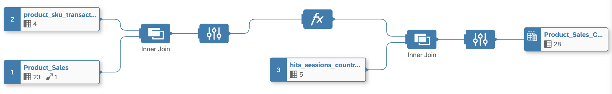

  
Solution

1. 👉 Open your [SAP Datasphere](https://ccebd5f3-3595-488d-846d-eda360636613.us10.hcs.cloud.sap/dwaas-ui/index.html#/home) using the provided credentials.
   
   Your user is associated with unique space (CATEGORY_MGMT_\<STUDENT>) where you can work and create your data artifacts. 
   
    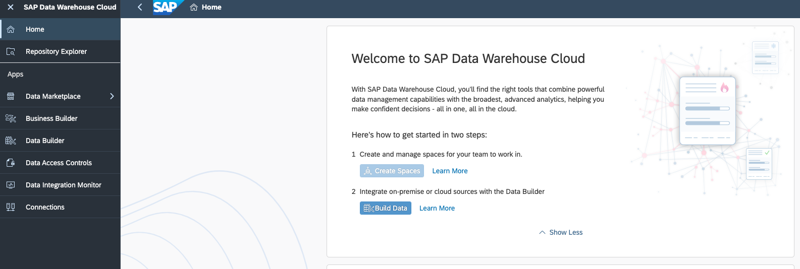

2. 👉 Go to **SAP Datasphere Data Builder** and create **New Graphical View**
    
    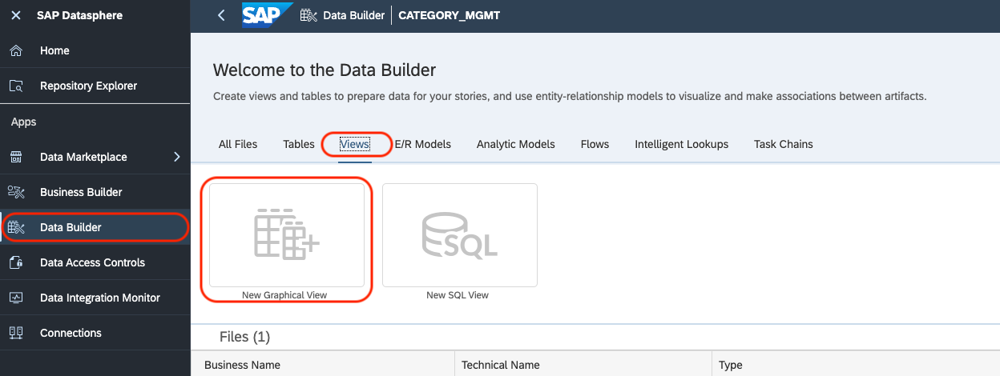

3. 👉 Open the **Shared Objects** from Repository, expand the views and drag and drop the following 3 views into the canvas
    - product_transactions_view
    - Product_Sales
    - hits_sessions_country_view
   
    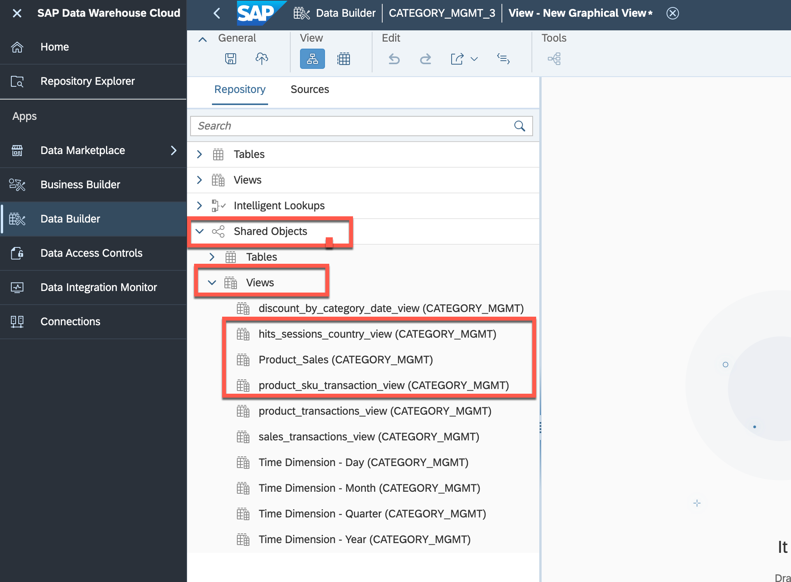

4. 👉 Drag and move **product_sku_transaction_view** on top of **Product_Sales** to create a **JOIN**
   
    

5. 👉 Define the following **JOIN** conditions:
    
    - Join Type: *Inner*
    - Mappings (see screenshot): DATE->DATE, Product_SKU->Product_SKU, transaction_id->transaction_id
   
    

6. 👉 Keep the Projection columns unchanged
   
7. 👉 Add new **Calculated Column** (see screenshot below)
   
    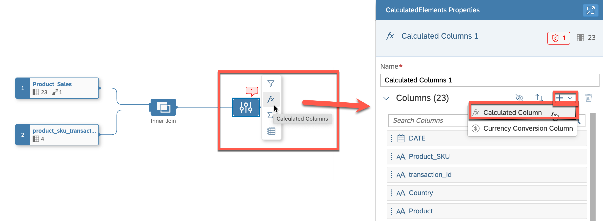

8. 👉 The idea of the calculated column is to have an additional DATE field with *String* data type, which is required for the next join. Add the following properties to the calculated column.
    - Business Name: *DATESTR*
    - Technical Name: *DATESTR*
    - Data Type: *String*
    - Lenght: *10*
    - Expression: *TO_NVARCHAR(DATE, 'YYYYMMDD')*
   
    

9. 👉 Drag and move **Calculated Column** on top of **hits_session_country_view** to create the second **JOIN**
   
    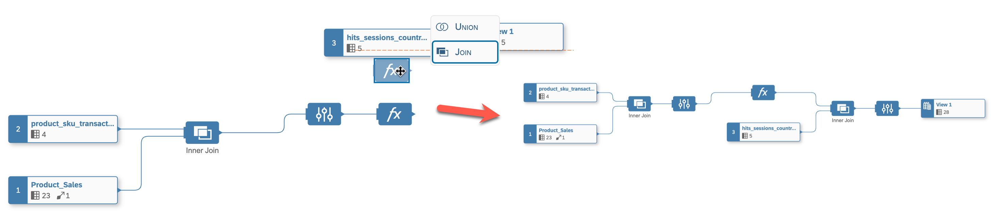

10. 👉 Define the following **JOIN** conditions:
    
    - Join Type: *Inner*
    - Mappings (see screenshot): DATESTR->DATET, Country->Country
   
    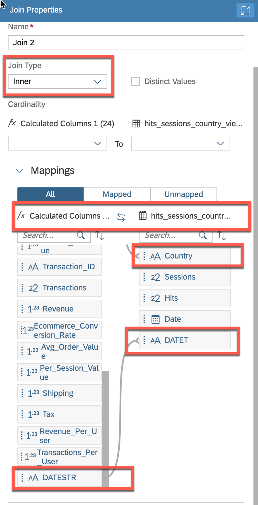

11. 👉 Finalyse the view by giving a name, semantic type and expose for consumption
    
    - Business Name: *Product_Sales_Country*
    - Technical Name: *Product_Sales_Country*
    - Semantic Usage: *Analytical Dataset*
    - Expose for Consumption: *On*
   
    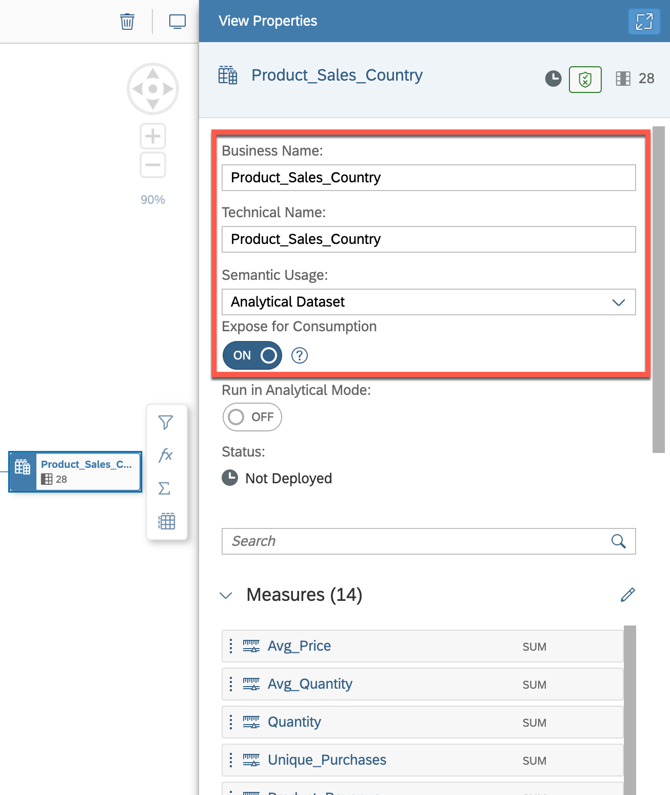

12. 👉 Create a new **Association**, search for the *"Time Dimension - Day"* and add it as a target.
    
    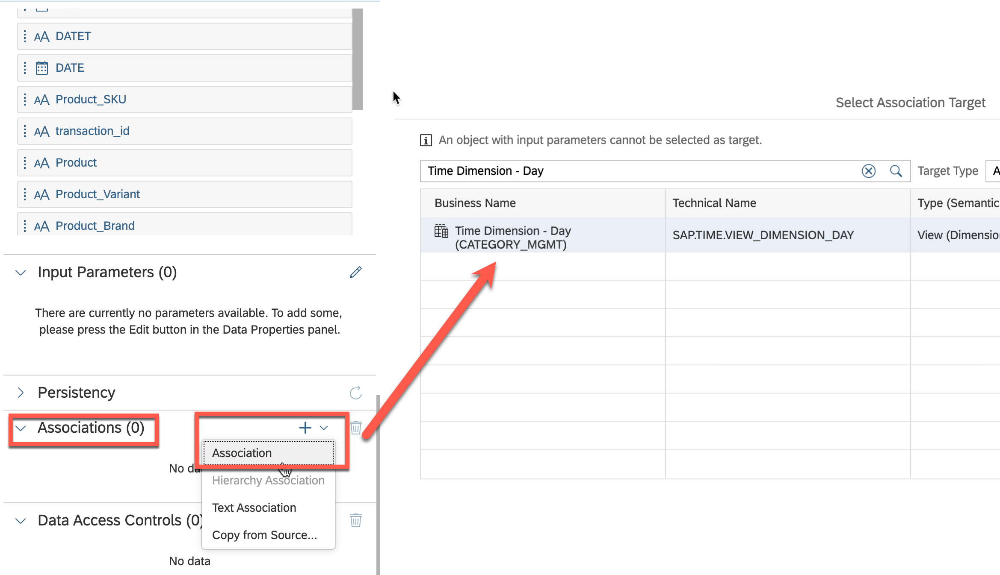

13. 👉 Create the following mapping: **DATE->Date**
    
    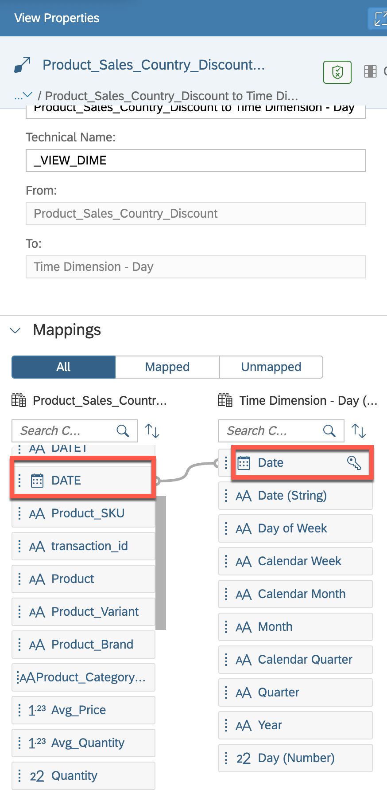

14. 👉 Save and deploy the **Product_Sales_Country** view
    
    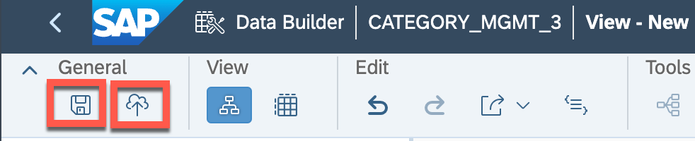

## Challenge 1.2 Creating a new view of "Product Sales Country Discount" 
 
The challenge is to create a new data view called **"Product Sales Country Discount"**. This view will be created by joining **"Product Sales Country"** with the **"Discount by Category Date"** view, which is federated from the SAP S/4HANA system. The purpose of this process is to combine the data from the two views to create a comprehensive view of product sales and discounts by country and date. The resulting **"Product Sales Country Discount"** view will provide valuable insights into sales trends, allowing you to make informed decisions about promotions and discounts.

To complete this challenge, you will need to follow these steps:

1. Join the "Product Sales Country" view with the "Discount by Category Date" view, using a common field such as "Date" and "category"
   >HINT: you need to create a LEFT Join
2. Identify the missing measures from the attributes and move them to measures
   >HINT: attributes: Sessions, Hits
3. Create an **Association** of the final view to **Time Dimension - Day**
   >HINT: you need to map following attribute: DATE

Your objective is to successfully complete these steps and generate a comprehensive data view that accurately reflects product sales and discounts by country and date. Good luck!

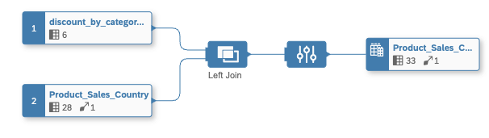

  
Solution

1. 👉 Go to **SAP Datasphere Data Builder** and create **New Graphical View**
    
    

2. 👉 Open the **Shared Objects** from Repository, expand the views and drag and drop the **"discount_by_category_date_view"** into the canvas.
3. 👉 Open the **Views** from the Repository and drop the **"Product_Sales_Country"** view into the canvas.
   
    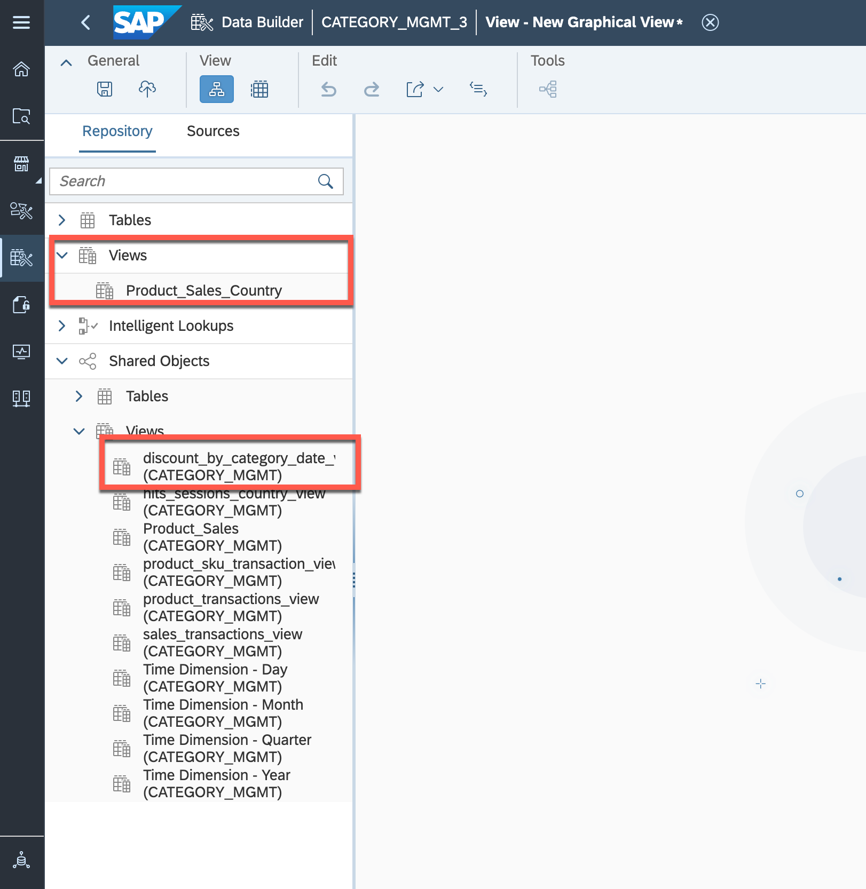

4. 👉 Drag and move **discount_by_category_date_view** on top of **Product_Sales_Country** to create a **JOIN**
   
    

5. 👉 Define the following **JOIN** conditions:
    
    - Join Type: *Left*
    - Mappings (see screenshot): Date->Date, Product_Category_Enhanced_Ecommerce->category
   
    

6. 👉 Keep the Projection columns unchanged

7. 👉 Finalyse the view by giving a name, semantic type and expose for consumption
    
    - Business Name: *Product_Sales_Country_Discount*
    - Technical Name: *Product_Sales_Country_Discount*
    - Semantic Usage: *Analytical Dataset*
    - Expose for Consumption: *On*
   
    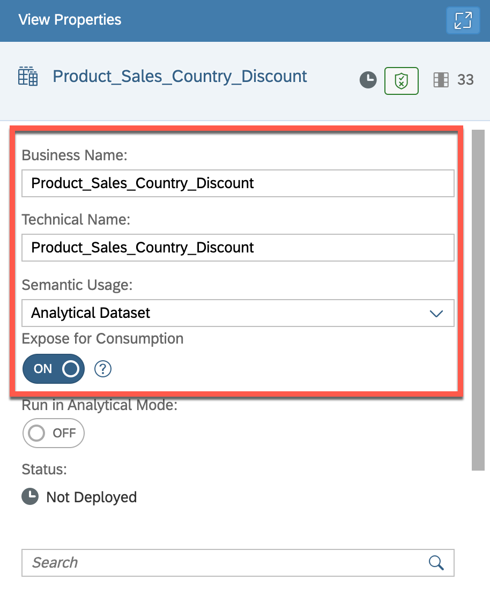

8. 👉 Move **Sessions** and **Hits** attributes to **Measures**
    
    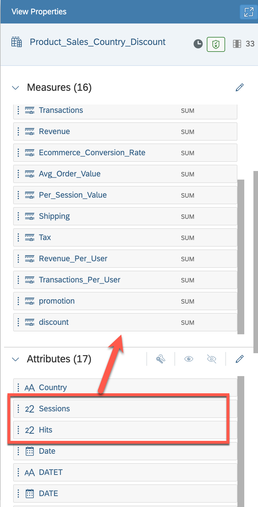

9. 👉 Create a new **Association**, search for the *"Time Dimension - Day"* and add it as a target.
    
    

10. 👉 Create the following mapping: **DATE->Date**
    
    

11. 👉 Save and deploy the **Product_Sales_Country_Discount** view
    
    

## Summary

The goal of Challenge 1 was to create two views in SAP Datasphere. The final view, "Product Sales by Country and Discount" was exposed and will be utilized by SAP Analytics Cloud to create a dashboard. This view provides insights into the sales of products by country and the discounts offered, which can be used to inform strategic business decisions. 

Continue to - [Challenge 2](../ex3/README.md)
