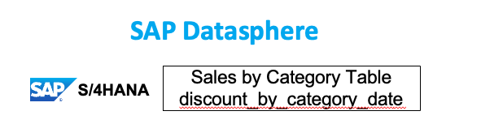
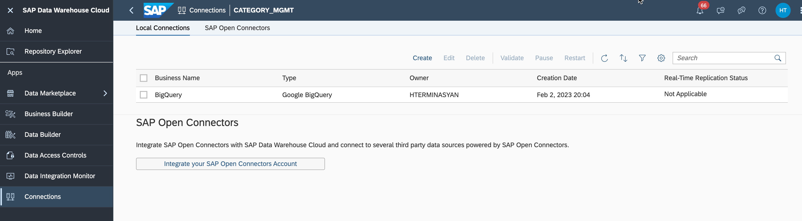
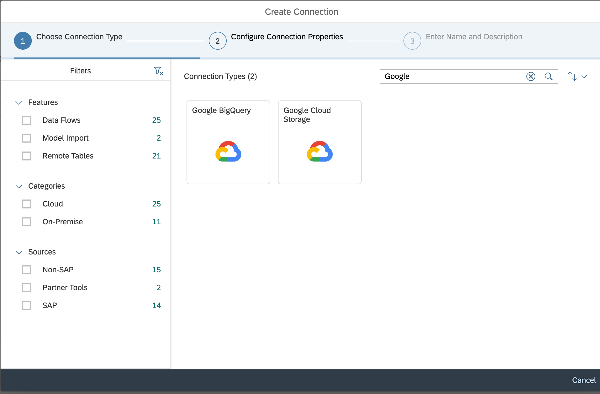
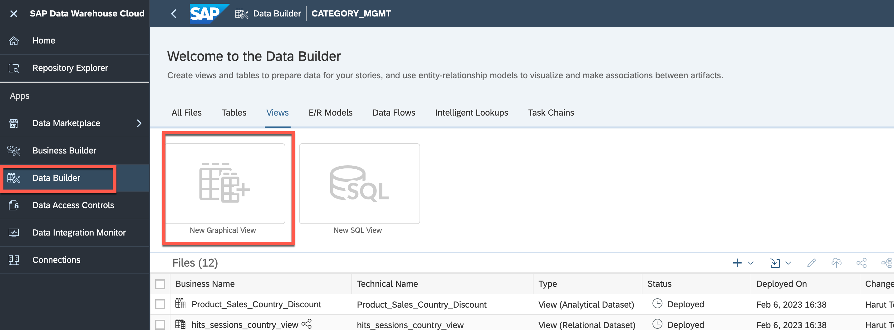
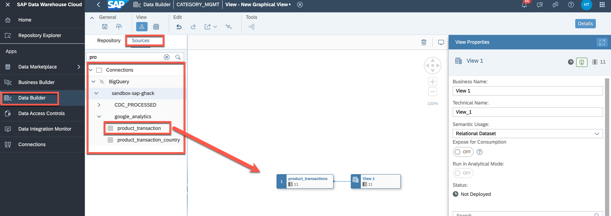
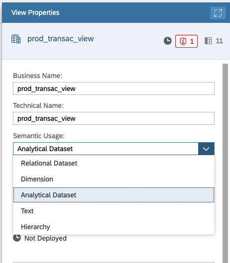
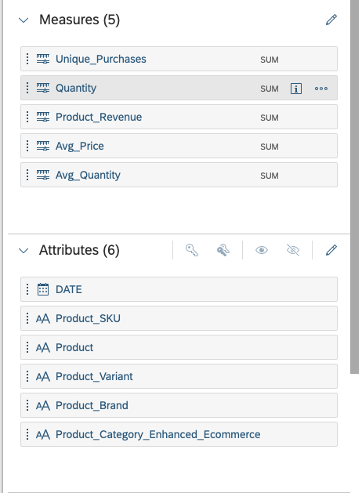
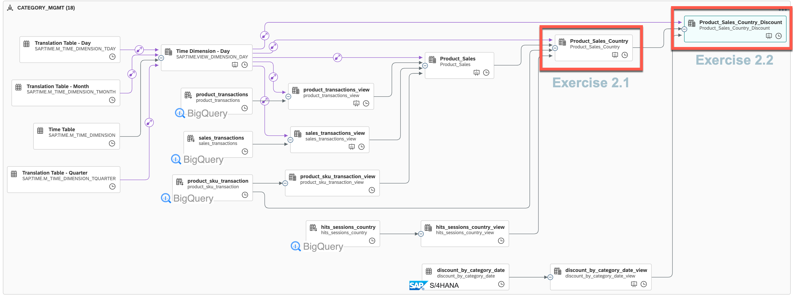

# Introduction - Understand the SAP Data Warehouse Cloud and Google BigQuery setup and given data models

> **IMPORTANT**: This exercise is for informational purposes only and does not require any actions to be taken by the participants. Its aim is to provide a better understanding of the preconfigurations. The goal is to provide a clear understanding of the concepts and techniques involved, without the need for any hands-on implementation.

## Role of SAP BTP
 - With SAP Data Warehouse Cloud, customers can federate queries across source systems (SAP and Google) without the need for data replication. 
 - SAP Analytics Cloud customers can execute live on the fly analysis across cross-cloud data sources in real-time (and live analytics to SAP HANA systems).
 - Unified SAP data model and semantics propagated from SAP S/4HANA and SAP CX systems to SAP DWC and SAP SAC

## Role of Google Cloud 
 - Query all data types with BigQuery: structured, semi-structured, and unstructured.
 - Scale seamlessly to store and analyze petabytes to exabytes of data with ease.
 - Easily access customer-centric measurement across sites and apps in order to understand what is working and what is not.
 - Google Analytics has easy-to-use interface and shareable reports for integration.

In this hands-on session, you will work with a sample BigQuery and sample SAP S/4HANA dataset. 
To analyze category performance for digital/online sales you can combine external source systems like Google Analytics and sales, discounts, and stock data from SAP S/4HANA systems.

To achieve this we can use public data sets of Google Analytics. In Google BigQuery public data sets are pre-loaded and publicly accessible data sets that you can use to develop and test your queries, or to gain insights into a variety of topics.

## Google BigQuery Data Model Overview

## SAP S/4HANA Sample Sales Data loaded in SAP Data Warehouse Cloud

## Introduction 1.1 Establishing live data integration between Google BigQuery and SAP Data Warehouse Cloud

Connections provide access to data from a wide range of sources, cloud as well as on-premise sources, SAP as well as Non-SAP sources, and partner tools. They allow space members to use entities from the connected source to acquire, prepare and access data from those sources in SAP Data Warehouse Cloud.

In the "Connections" section of SAP DWC we already created live connectivity to Google Bigquery by providing a service key from GCP account. This connection is used in the next steps of Hands-on exercises to create data views on remote tables from Google BigQuery.

## Introduction 1.2 Creating Views on SAP DWC

In this section, an example of DWC view will be created using Google BigQuery remote tables. For simplicity, the creation process will be done for you and the views will be shared to reuse in upcoming exercises.

>**Important** This views are already created and shared with you for the next excersice, so no need to recreate them.

1. How to create **New Graphical View** from the **SAP DWC Data Builder** 
   
    

2. How to find the **Sources** and look for the remote table from BigQuery connections. The user should drag the desired table from the left side to the canvas and select "Import and Deploy" from the pop-up dialog. For instance, the *product_transaction* table can serve as an example. 
    
    

3. The view can be renamed as desired and the "Analytical Dataset" option should be selected from the Semantic Usage dropdown. This step is not necessary for mapping tables and they can remain as "Relational Dataset."
   
    

4. The "Expose for Consumption" toggle should be turned on and the dimensions should be selected.
   
    

5. The process should be saved and deployed.
6. This process should be repeated for each of the tables created in BigQuery from the Google Analytics dataset and the SAP source systems. Views should also be created in the same manner from the "Tables" section of Data Builder for the data from the SAP source system.

## Overview of final view required for Analytics Dashboard

The below diagram shows the final result of the view which is essential for the Analytics Dashboard. This result is crucial to providing valuable insights and data representation in the dashboard.

>You can once again visually see the remote tables from BigQuery and SAP S/4HANA

>In a diagram is also marked the views, which you will create in next excersice yourself

## Summary

The goal of this introduction was to give a clear understanding of the concepts and techniques involved in creating a DWC view using Google BigQuery remote tables. 

Continue to - [Exercise 2](../ex2/README.md)
