# Exercise 3 - Create Category Management Dashboard on SAP Analytics Cloud

This exercise will focus on using the views created in a previous exercise to create rich Category Management reports in SAP Analytics Cloud. By integrating these data sources, the reports will allow for powerful data analysis and visualization of the sales performance of different product categories. The information gathered from these reports can be used to make informed decisions about product assortment, pricing, and promotions. The use of Big Query and SAP source systems will ensure that the data used in these reports is accurate, up-to-date, and consistent, providing a solid foundation for effective Category Management decision-making.

## Exercise 3.1 Creating the Layout for the Category Management Dashboard

1. 👉 Open the [SAP Analytics Cloud](https://sunrise.us10.hcs.cloud.sap/sap/fpa/ui/app.html#/home) using the provided credentials.
   
    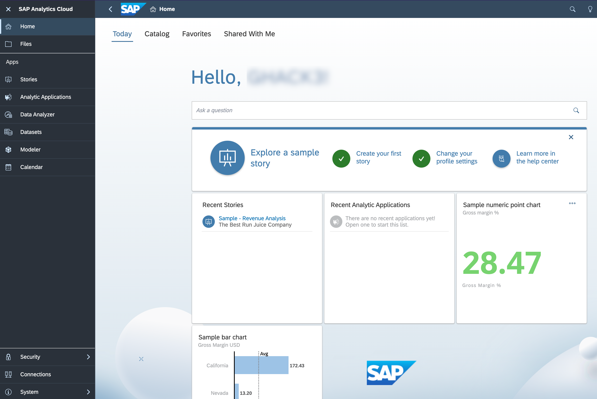

2. 👉 Go to the **Stories** and create a new **Canvas**
    
    >Use the Optimized Design mode, which provides an improved experience when designing dashboards. This mode has some useful new features, but it does not include all the features that are currently supported in the Classic Design mode.
    
    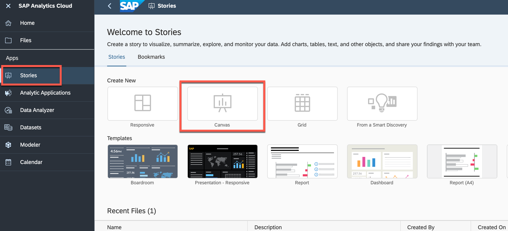

3. 👉 Drag and drop a **Text** field to give the dashboard name *"Product Category over Time"*
4. 👉 Drag and drop 4 **Panels** into the canvas to shape a layout for the charts (see the screenshot below)
 
    

## Exercise 3.2 Assigning the data (Product_Sales_Country_Discount) from SAP DWC to Dashboard

1. 👉 Go to the **Tools** and press **Add new Data**, than select **Data from a data source**
    
    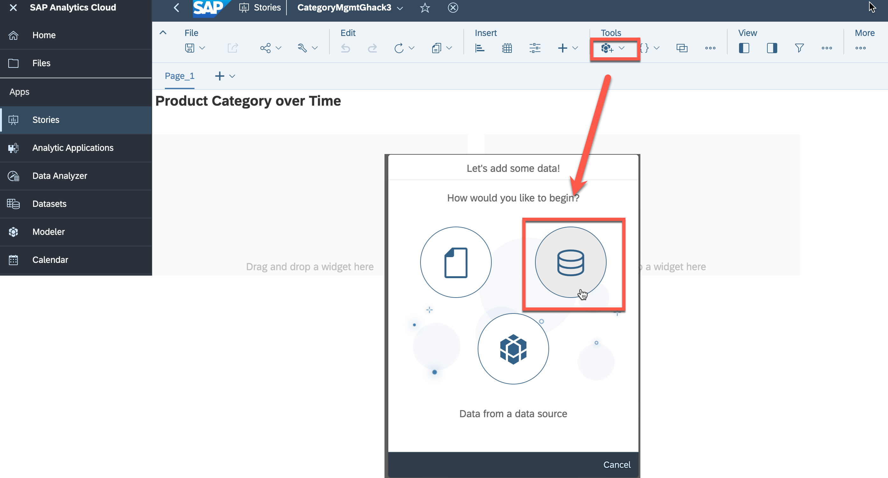

2.  👉 Choose **SAP Data Warehouse Cloud** as a source from the "Connect to Live Data" section
    
    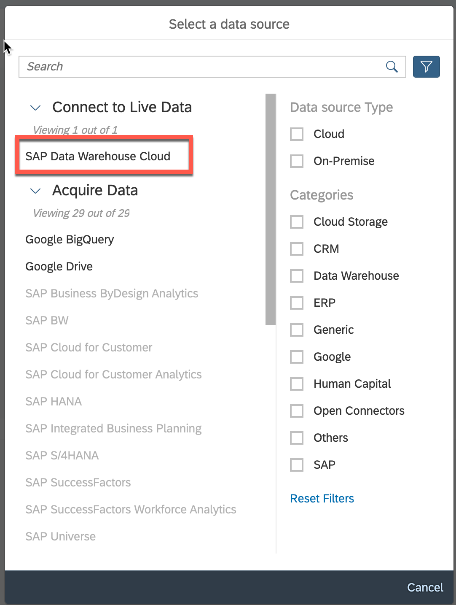

3.  👉 Select the connection, your space and the dataset
    - Connection: **PAADWC**
    - Space: **CATEGORY_MGMT_\<STUDENT>**
    - Dataset: **Product_Sales_Country_Discount**
  
    

## Exercise 3.2 Creating the first Chart for displaying **Quantity per Product Category**

After assigning the dataset, you can start building your first charts

1. 👉 Drag and drop from the left panel a **Chart** widget into the first container

   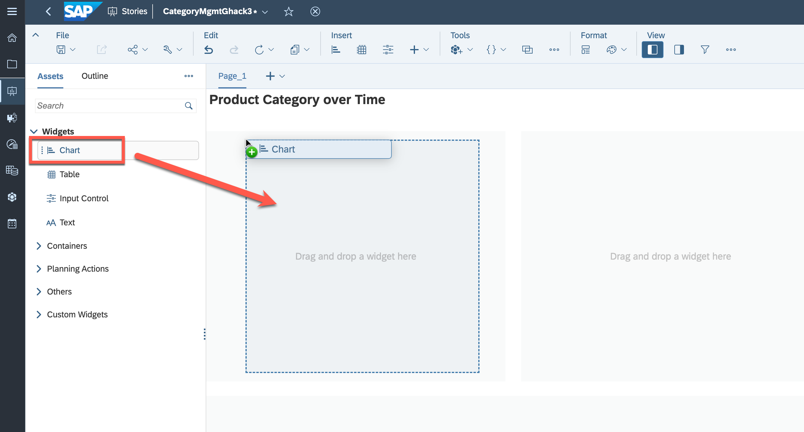

2. 👉 Select the chart and add the following properties in a **Builder** on the right panel 
    - Measure: **Quantity**
    - Dimensions: **Product_Category_Enhanced_Ecommerce**

   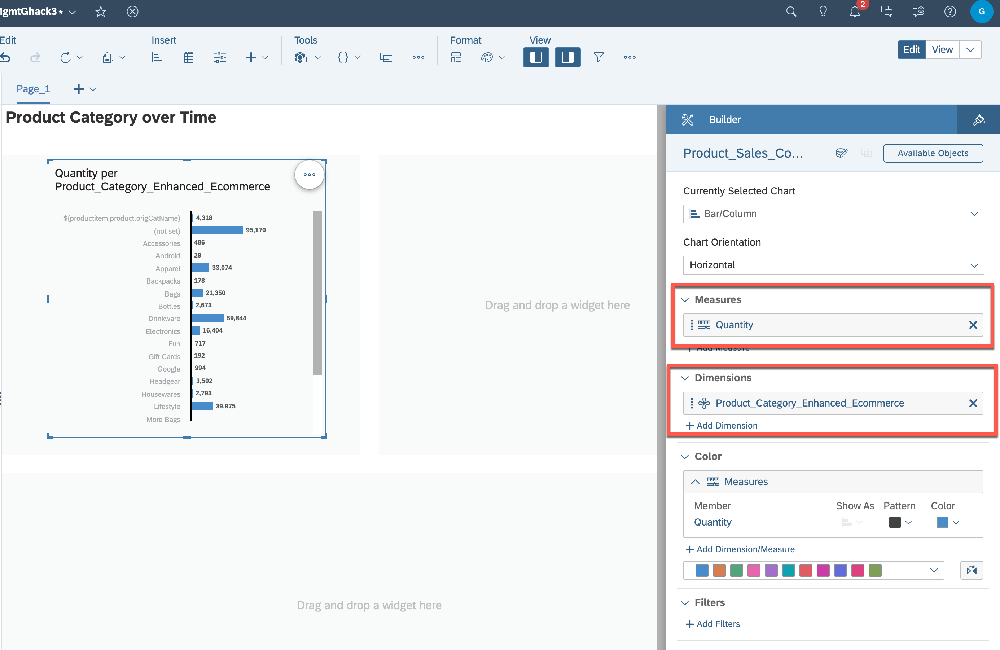

3. 👉 Click on the **...** "More Actions" and rank the **Product_Category_Enhanced_Ecommerce** as **Top 10**, to display top products per category.

   

4. 👉 Exclude the **(not set)** and **${productitem.product.origCatName}** attributes by selecting them and pressing **X**

   

5. 👉 Give some proper name ("Quantity per Product Category") and your first chart is ready

   

## Exercise 3.3 Creating another Chart for displaying **Discount per Product Category**

Similar to the previous approach create another chart to visualize the **Discount** per Product Category**

1. 👉 Drag and drop from the left panel a **Chart** widget into the secound container

   

2. 👉 Select the chart and add the following properties in a **Builder** on the right panel 
    - Dimensions: **Product_Category_Enhanced_Ecommerce**

   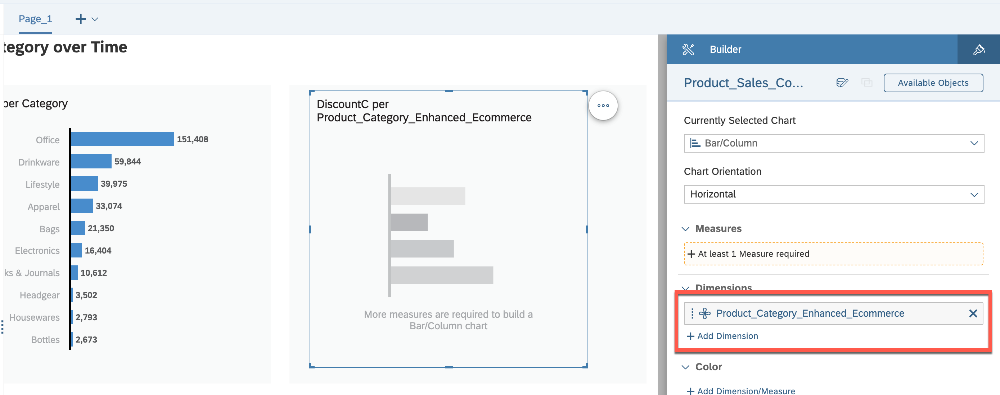

3. 👉 Add a new **Calculation** as a **Measure**
    - Type: **Calculated Measure**
    - Name: **DiscountC**
    - Formula: **["Product_Sales_Country_Discount":discount]**

   

4. 👉 Format it as a **Percentage****

   

5. 👉 Click on the **...** "More Actions" and rank the **Product_Category_Enhanced_Ecommerce** as **Top 10**, to display top products per category.

   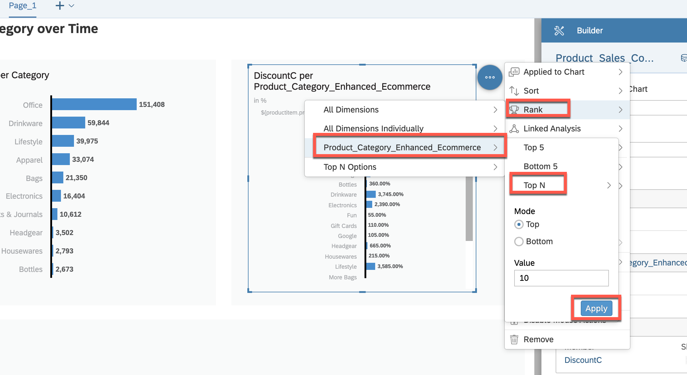

6. 👉 Exclude the **(not set)** and **${productitem.product.origCatName}** attributes by selecting them and pressing **X**

   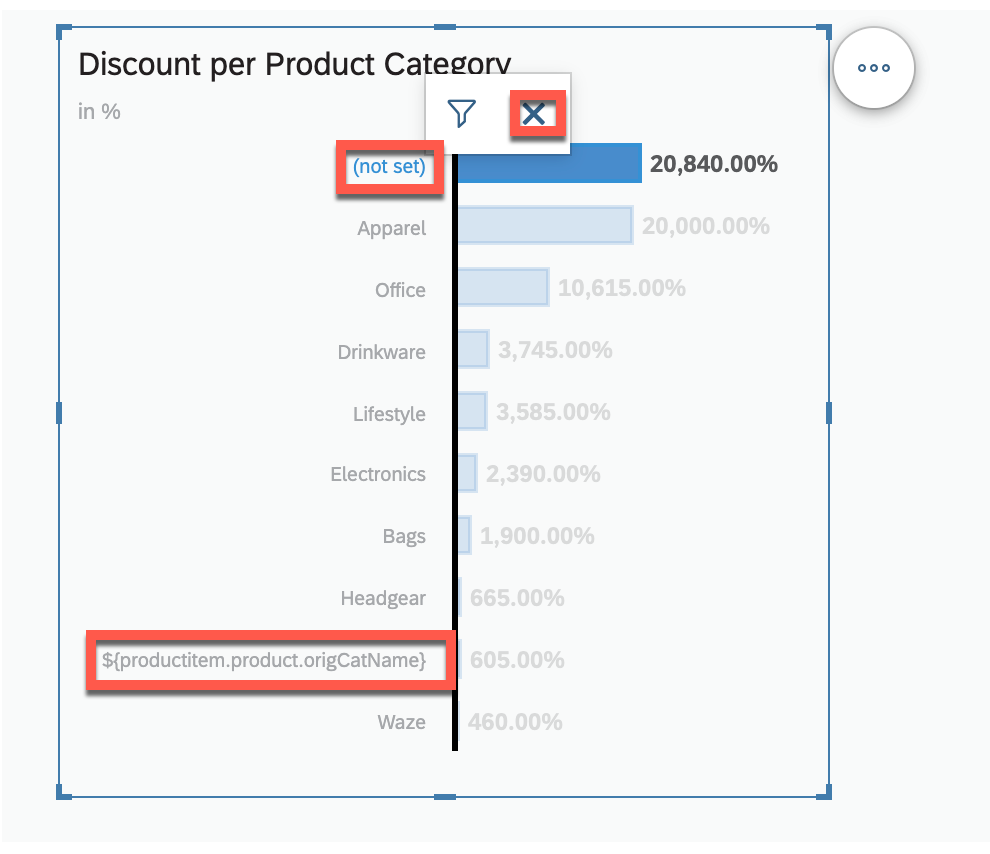

7. 👉 Give some proper name ("Discount per Product Category") and your second chart is ready. Optionally you can add a reference line for the average discount.

   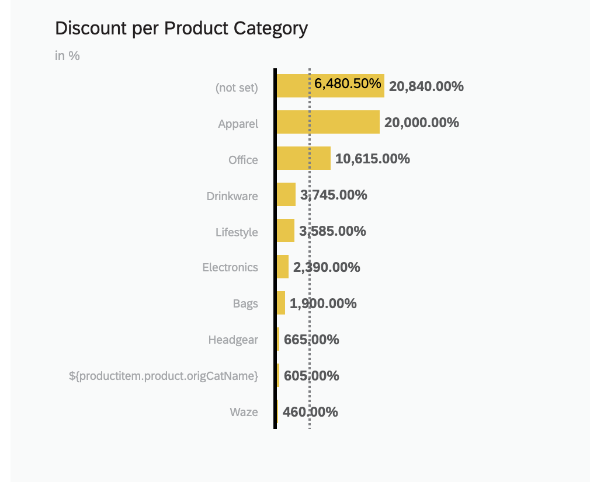

## Exercise 3.4 Creating the last Chart for displaying **Sales Quantity over Time**

1. 👉 Drag and drop from the left panel another **Chart** widget into the bottom container

   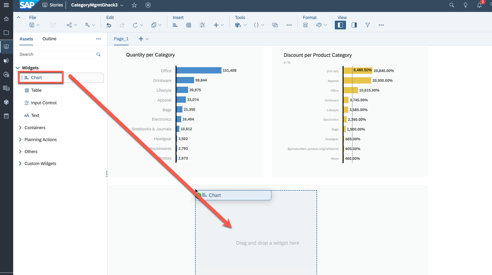

2. 👉 Select the chart and add the following properties in a **Builder** on the right panel 
    - Currently Selected Chart: **Line**
    - Measure: **Quantity**
    - Dimensions: **DATE** and set Hierarchy to **Level 3**

   

3. 👉 Add a new **Variance** to compare the **Current Time Interval** with the **Previous Time Interval** by using the properties displayed below

   

4. 👉 Give some proper name ("Sales Quantity over Time (with variance to Previous months)") and your last chart is ready

   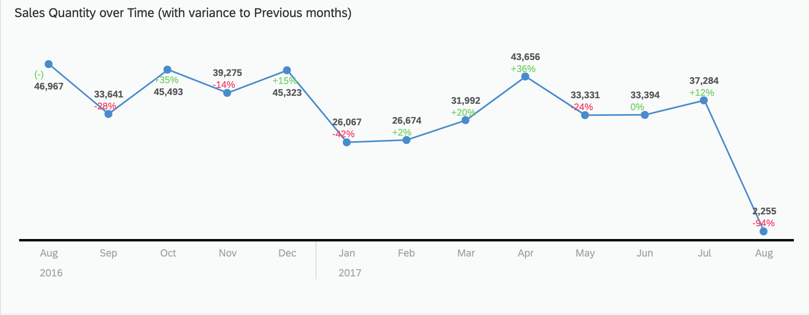

## Exercise 3.5 Creating ** Input Controls** for the dashboard

Finally, after having the charts, you can add some input controls to filter the data displayed on the dashboard 

1. 👉 Drag and drop from the left panel **Input Control** widget into the top container

   

2. Choose the **DATE** as a dimension and give a fixed range for the filter

   

3. Repeat steps 1 and 2 to create three other **Input Controls**
   
   - Input control for filtering the **Country**
   - Input control for filtering the **Product Category**
   - Input control for filtering the **Product Variant**

   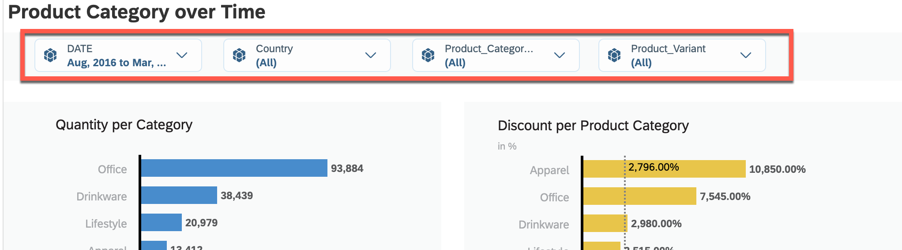

After defining those filters you can filter the dashboard by country, time, product category, and product variant. This allows for deeper insights into the data by allowing you to view specific subsets of information based on your needs.

## Result

Below you can find the final result of your dashboard

 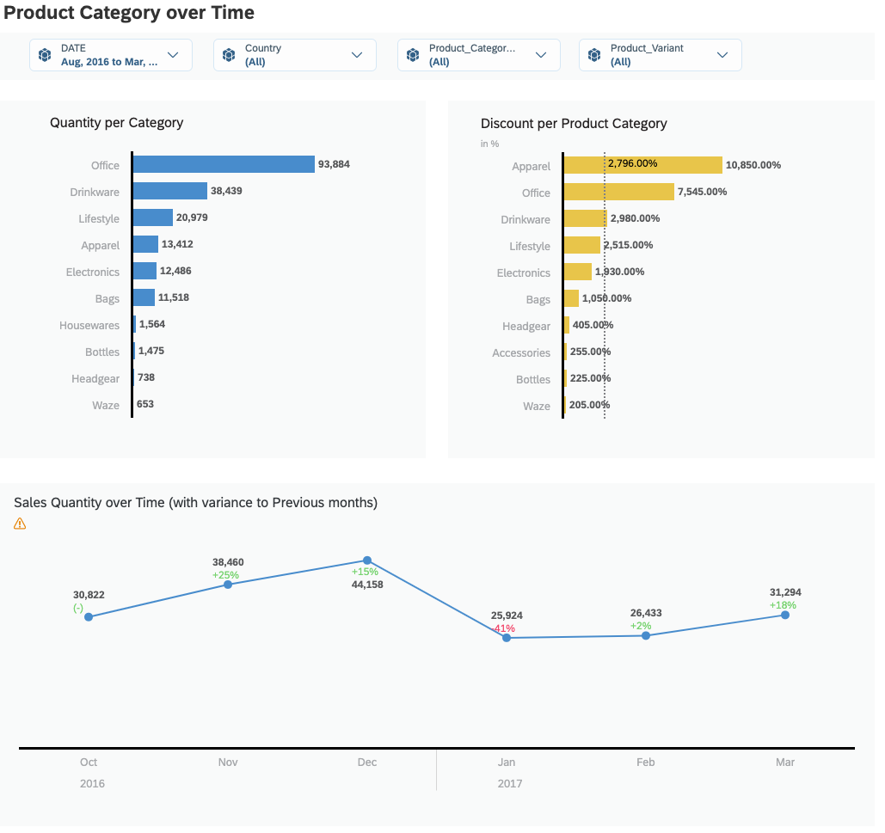

You can add more charts to the dashboard at any time to extend its capabilities and better meet the business requirements. The SAP Analytics Cloud platform offers a wide range of chart options, making it possible to display data in a variety of ways to suit different needs and preferences.

>An example of more extensive dashboard can be found below

 

## Summary

In this exercise, you have created your first dashboard using SAP Analytics Cloud to gain insights into sales data based on different product categories. 
Through this exercise, you learned how to use the platform to create a simple dashboard to analyze and visualize the data.